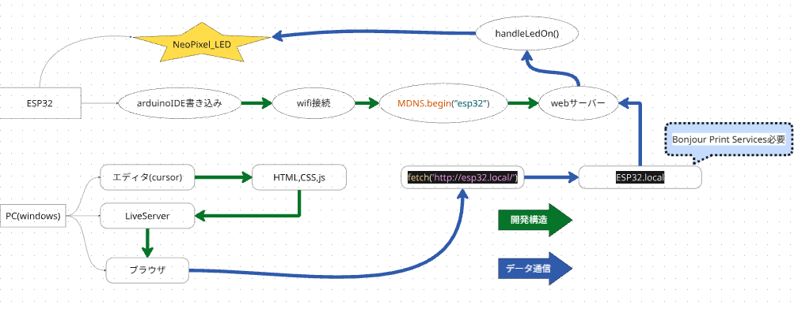

# ESP32 LED Controller
ブラウザからLEDの光り方を操作できるようにしたコードです。 
今回はmDNSを使用したのでIPアドレスが変わってもマイコンと操作デバイスが同じWIFIにつながっていれば操作できるようになっています。
## APIの流れについて

動画で実際に光らせているので良ければご覧ください。
 
https://youtube.com/shorts/1yj3Q7_K6Y8
 
arduinoIDE,ESP32,NeoPixel_LED使用

